# Metrics

We provide various metrics about memory, disk, and important procedures. These metrics could help identify performance
issue or monitor RSS cluster.

## Prerequisites

1.Enable RSS metrics.
set rss.metrics.system.enabled = true  
2.You need to install prometheus(https://prometheus.io/)  
We provide an example for prometheus config file

```yaml
# prometheus example config
global:
  scrape_interval: 15s
  evaluation_interval: 15s

scrape_configs:
  - job_name: "RSS"
    metrics_path: /metrics/prometheus
    scrape_interval: 15s
    static_configs:
      - targets: [ "emr-header-1:9098","emr-worker-1:9096","emr-worker-2:9096","emr-worker-3:9096","emr-worker-4:9096" ]
```

3.You need to install Grafana server(https://grafana.com/)

## Details

|        MetricName         |       Role        |                                                  Description                                                   |
|:-------------------------:|:-----------------:|:--------------------------------------------------------------------------------------------------------------:|
|        WorkerCount        |      master       |                                          The count of active workers.                                          |
|    OverloadWorkerCount    |      master       |                                        The count of overloaded workers.                                        |
|  BlacklistedWorkerCount   |      master       |                                       The count of workers in blacklist.                                       |
|  RegisteredShuffleCount   | master and worker |                                  The value means count of registered shuffle.                                  |
|      CommitFilesTime      |      worker       |                          CommitFiles means flush and close a shuffle partition file.                           |
|     ReserveSlotsTime      |      worker       |                    ReserveSlots means acquire a disk buffer and record partition location.                     |
|       FlushDataTime       |      worker       |                                  FlushData means flush a disk buffer to disk.                                  |
|      OpenStreamTime       |      worker       |            OpenStream means read a shuffle file and send client about chunks size and stream index.            |
|      FetchChunkTime       |      worker       |                     FetchChunk means read a chunk from a shuffle file and send to client.                      |
|    MasterPushDataTime     |      worker       |                       MasterPushData means handle pushdata of master partition location.                       |
|     SlavePushDataTime     |      worker       |                       MasterPushData means handle pushdata of slave partition location.                        |
|     PushDataFailCount     |      worker       |                                The count of failed PushData or PushMergedData.                                 |
|      TakeBufferTime       |      worker       |                             TakeBuffer means get a disk buffer from disk flusher.                              |
|         SlotsUsed         |      worker       |                                                                                                                |
|        NettyMemory        |      worker       |                        The value measures all kinds of transport memory used by netty.                         |
|         SortTime          |      worker       |                           SortTime measures the time used by sorting a shuffle file.                           |
|        SortMemory         |      worker       |                       SortMemory means total reserved memory for sorting shuffle files .                       |
|       SortingFiles        |      worker       |                              This value means the count of sorting shuffle files.                              |
|        DiskBuffer         |      worker       | Disk buffers are part of netty used memory, means data need to write to disk but haven't been written to disk. |
|       PausePushData       |      worker       |                  PausePushData means the count of worker stopped receiving data from client.                   |
| PausePushDataAndReplicate |      worker       |   PausePushDataAndReplicate means the count of worker stopped receiving data from client and other workers.    |

## Implementation

RSS master metric : `com/aliyun/emr/rss/service/deploy/master/MasterSource.scala`  
RSS worker metric : `com/aliyun/emr/rss/service/deploy/worker/WorkerSource.scala`
and `com.aliyun.emr.rss.common.metrics.source.NetWorkSource`

## Grafana Dashboard

We provide a grafana dashboard for RSS [Grafana-Dashboard](assets/grafana/rss-dashboard.json). The dashboard was generated by grafana of version 8.5.0.
Here are some snapshots:

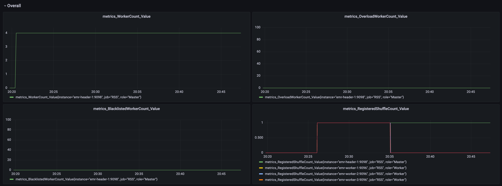
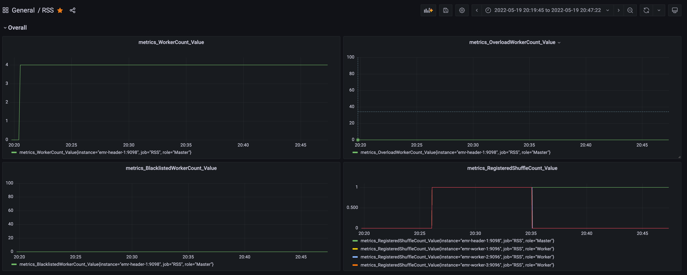
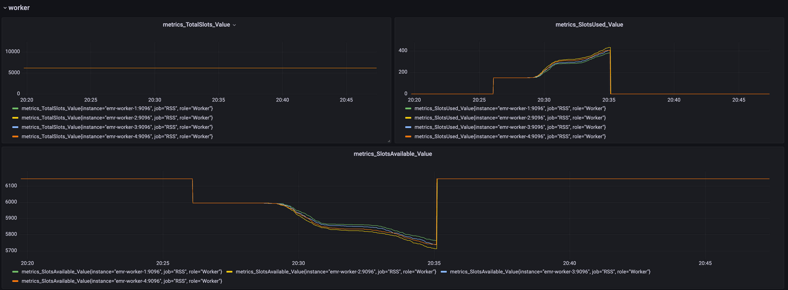
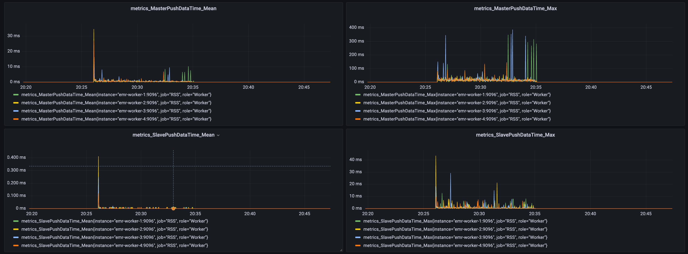
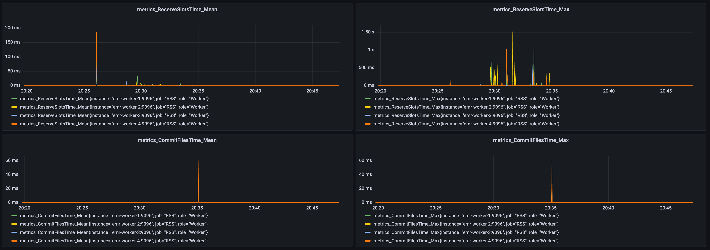
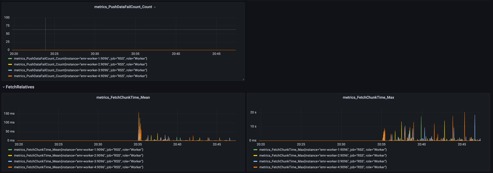
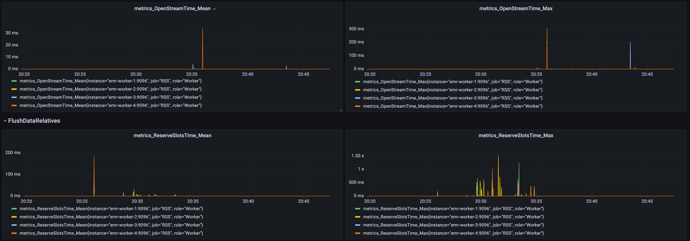
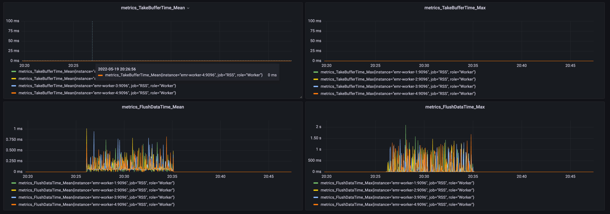
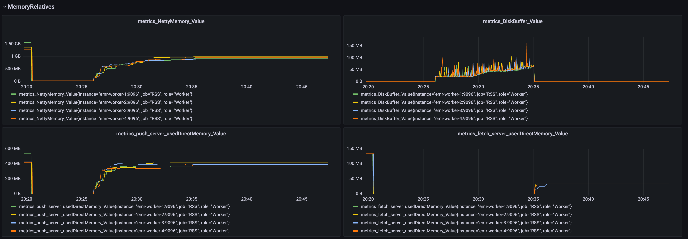
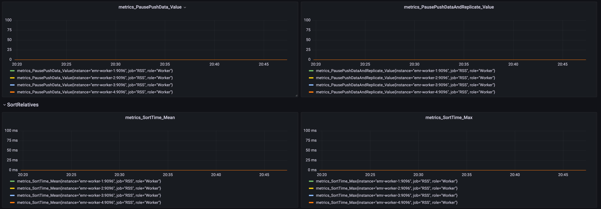
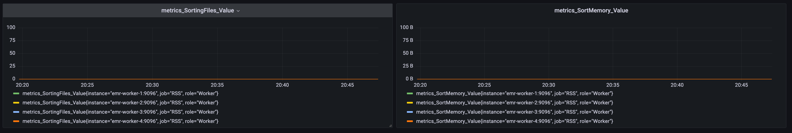
