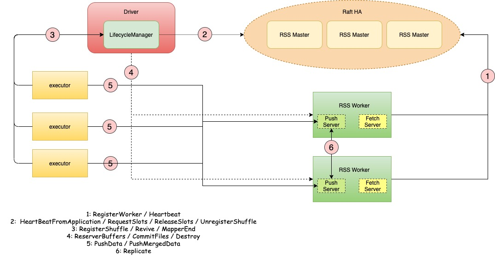
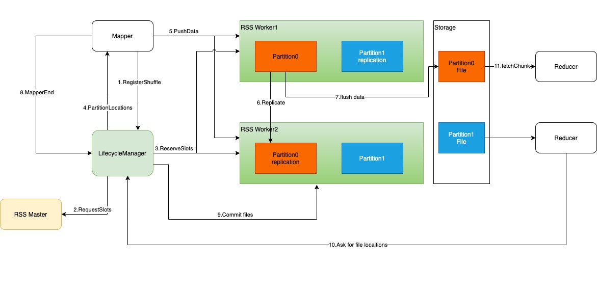
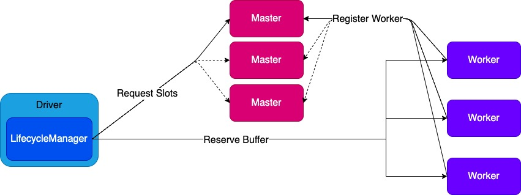

# Aliyun Remote Shuffle Service

[](https://github.com/alibaba/RemoteShuffleService/actions/workflows/maven.yml)

[](https://gitter.im/RemoteShuffleServiceCommunity/community?utm_source=badge&utm_medium=badge&utm_campaign=pr-badge&utm_content=badge)

Aliyun Remote Shuffle Service(RSS) is dedicated to improving the efficiency and elasticity of
different map-reduce engines. RSS provides an elastic and high efficient
management service for shuffle data.  

## Internals
### Architecture 

RSS has three primary components: Master, Worker, and Client.
Master manages all resources and syncs shard states with each other based on Raft.
Worker processes read-write requests and merges data for each reducer.
LifecycleManager maintains metadata of each shuffle and runs within the Spark driver.

### Feature
1. Disaggregate Compute and storage.
2. Push-based shuffle write and merged shuffle read.
3. High availability and high fault tolerance.

### Shuffle Process

1. Mappers lazily ask LifecycleManager to registerShuffle.
2. LifecycleManager requests slots from Master.
3. Workers reserve slots and create corresponding files.
4. Mappers get worker locations from LifecycleManager.
5. Mappers push data to specified workers.
6. Workers merge and replicate data to its peer.
7. Workers flush to disk periodically.
8. Mapper tasks accomplish and trigger MapperEnd event.
9. When all mapper tasks complete, workers commit files.
10. Reducers ask for file locations.
11. Reducers read shuffle data.

### Load Balance


We introduce slots to achieve load balance. We will equally distribute partitions on every RSS worker by tracking slots usage.
The Slot is a logical concept in RSS Worker that represents how many partitions can be allocated on each RSS Worker.
RSS Worker's slot count is decided by `rss.worker.numSlots` or`rss.worker.flush.queue.capacity * (number of RSS Worker storage directories)` if `rss.worker.numSlots` is not set.
RSS worker's slot count decreases when a partition is allocated and increments when a partition is freed.  

## Build
RSS supports Spark2.x(>=2.4.0), Spark3.x(>=3.0.1) and only tested under Java8(JDK1.8).

Build for Spark 2    
`
./dev/make-distribution.sh -Pspark-2 -Plog4j-1/-Plog4j-2
`

Build for Spark 3  
`
./dev/make-distribution.sh -Pspark-3 -Plog4j-1/-Plog4j-2
`

Build for Spark 2 on MacOS Apple M1/Arm(For testing purposes only, not recommended for production.)  
`
./dev/make-distribution.sh -Pspark-2 -Plog4j-1/-Plog4j-2 -Dos.detected.name=osx -Dos.detected.arch=x86_64 -Dos.detected.classifier=osx-x86_64
`

Build for Spark 3 on MacOS Apple M1/Arm(For testing purposes only, not recommended for production.)   
`
./dev/make-distribution.sh -Pspark-3 -Plog4j-1/-Plog4j-2 -Dos.detected.name=osx -Dos.detected.arch=x86_64 -Dos.detected.classifier=osx-x86_64
`

package rss-${project.version}-bin-release.tgz will be generated.

### Package Details
Build procedure will create a compressed package.
```
    ├── RELEASE                         
    ├── bin                             
    ├── conf                            
    ├── master-jars                     
    ├── worker-jars                     
    ├── sbin                            
    └── spark                       //Spark client jars
```

### Compatibility
RSS server is compatible with both Spark2 and Spark3.
You can run both Spark2 and Spark3 with the same RSS server. It doesn't matter whether RSS server is compiled with -Pspark-2 or -Pspark-3.
However, RSS client must be consistent with the version of the Spark.
That is, if you are running Spark2, you must compile RSS client with -Pspark-2; if you are running Spark3, you must compile RSS client with -Pspark-3.

## Usage
RSS supports HA mode deployment.

### Deploy RSS
1. Unzip the package to $RSS_HOME
2. Modify environment variables in $RSS_HOME/conf/rss-env.sh
   
EXAMPLE:
```properties
#!/usr/bin/env bash
RSS_MASTER_MEMORY=4g
RSS_WORKER_MEMORY=2g
RSS_WORKER_OFFHEAP_MEMORY=4g
```
3. Modify configurations in $RSS_HOME/conf/rss-defaults.conf
   
EXAMPLE: single master cluster
```properties
rss.master.address master-host:port
rss.metrics.system.enabled true
rss.worker.flush.buffer.size 256k
rss.worker.flush.queue.capacity 4096
rss.worker.base.dirs /mnt/disk1/,/mnt/disk2
# If your hosts have disk raid or use lvm, set rss.device.monitor.enabled to false
rss.device.monitor.enabled false
```   
  
EXAMPLE: HA cluster
```properties
rss.metrics.system.enabled true
rss.worker.flush.buffer.size 256k
rss.worker.flush.queue.capacity 4096
rss.worker.base.dirs /mnt/disk1/,/mnt/disk2
rss.master.port 9097
# If your hosts have disk raid or use lvm, set rss.device.monitor.enabled to false
rss.device.monitor.enabled false

rss.ha.enabled true
rss.ha.service.id dev-cluster
rss.ha.nodes.dev-cluster node1,node2,node3
rss.ha.address.dev-cluster.node1 host1
rss.ha.address.dev-cluster.node2 host2
rss.ha.address.dev-cluster.node3 host3
rss.ha.storage.dir /mnt/disk1/rss_ratis/
rss.ha.master.hosts host1,host2,host3
```
4. Copy RSS and configurations to all nodes
5. Start RSS master
`$RSS_HOME/sbin/start-master.sh`
6. Start RSS worker
For single master cluster : `$RSS_HOME/sbin/start-worker.sh rss://masterhost:port`
For HA cluster :`$RSS_HOME/sbin/start-worker.sh`
7. If RSS start success, the output of Master's log should be like this: 
```angular2html
21/12/21 20:06:18,964 INFO [main] Dispatcher: Dispatcher numThreads: 64
21/12/21 20:06:18,994 INFO [main] TransportClientFactory: mode NIO threads 8
21/12/21 20:06:19,113 WARN [main] ServerBootstrap: Unknown channel option 'TCP_NODELAY' for channel '[id: 0x8a9442f6]'
21/12/21 20:06:19,129 INFO [main] Utils: Successfully started service 'MasterSys' on port 9097.
21/12/21 20:06:19,150 INFO [main] HttpServer: HttpServer started on port 7001.
21/12/21 20:06:21,615 INFO [netty-rpc-connection-0] TransportClientFactory: Successfully created connection to /172.16.159.100:40115 after 4 ms (0 ms spent in bootstraps)
21/12/21 20:06:21,661 INFO [dispatcher-event-loop-9] Master: Registered worker
Host: 172.16.159.100
RpcPort: 40115
PushPort: 35489
FetchPort: 35689
TotalSlots: 4096
SlotsUsed: 0
SlotsAvailable: 4096
LastHeartBeat: 0
WorkerRef: NettyRpcEndpointRef(ess://WorkerEndpoint@172.16.159.100:40115)
.
21/12/21 20:06:23,785 INFO [netty-rpc-connection-1] TransportClientFactory: Successfully created connection to /172.16.159.98:39151 after 1 ms (0 ms spent in bootstraps)
21/12/21 20:06:23,817 INFO [dispatcher-event-loop-17] Master: Registered worker
Host: 172.16.159.98
RpcPort: 39151
PushPort: 40193
FetchPort: 37455
TotalSlots: 4096
SlotsUsed: 0
SlotsAvailable: 4096
LastHeartBeat: 0
WorkerRef: NettyRpcEndpointRef(ess://WorkerEndpoint@172.16.159.98:39151)
.
21/12/21 20:06:25,948 INFO [netty-rpc-connection-2] TransportClientFactory: Successfully created connection to /172.16.159.99:41955 after 1 ms (0 ms spent in bootstraps)
21/12/21 20:06:26,009 INFO [dispatcher-event-loop-25] Master: Registered worker
Host: 172.16.159.99
RpcPort: 41955
PushPort: 37587
FetchPort: 46865
TotalSlots: 4096
SlotsUsed: 0
SlotsAvailable: 4096
LastHeartBeat: 0
WorkerRef: NettyRpcEndpointRef(ess://WorkerEndpoint@172.16.159.99:41955)
```

### Deploy Spark client
Copy $RSS_HOME/spark/*.jar to $SPARK_HOME/jars/

### Spark Configuration
To use RSS, following spark configurations should be added.
```properties
spark.shuffle.manager org.apache.spark.shuffle.rss.RssShuffleManager
# must use kryo serializer because java serializer do not support relocation
spark.serializer org.apache.spark.serializer.KryoSerializer

# if you are running HA cluster ,set spark.rss.master.address to any RSS master
spark.rss.master.address rss-master-host:rss-master-port
spark.shuffle.service.enabled false

# optional:hash,sort
# Hash shuffle writer use (partition count) * (rss.push.data.buffer.size) * (spark.executor.cores) memory.
# Sort shuffle writer use less memory than hash shuffle writer, If your shuffle partition count is large, try to use sort hash writer.  
spark.rss.shuffle.writer.mode hash

# we recommend set spark.rss.push.data.replicate to true to enable server-side data replication 
spark.rss.push.data.replicate true

# Support for Spark AQE only tested under Spark 3
# we recommend set localShuffleReader to false to get better performance of RSS
spark.sql.adaptive.localShuffleReader.enabled false

# we recommend enable aqe support to gain better performance
spark.sql.adaptive.enabled true
spark.sql.adaptive.skewJoin.enabled true 
```

### Best Practice
If you want to set up a production-ready RSS cluster, your cluster should have at least 3 masters and at least 4 workers.
Masters and works can be deployed on the same node, but should not deploy multiple masters or workers on the same node.
See more detail in [CONFIGURATIONS](CONFIGURATION_GUIDE.md)  

### Support Spark Dynamic Allocation
We provide a patch to enable users to use Spark with both dynamic allocation and Remote Shuffle Service.
For Spark2.x check [Spark2 Patch](assets/spark-patch/RSS_RDA_spark2.patch).  
For Spark3.x check [Spark3 Patch](assets/spark-patch/RSS_RDA_spark3.patch).  

### Metrics
RSS have various metrics. [METRICS](METRICS.md) 

## Contribution
This is an active open-source project. We are always open to developers who want to use the system or contribute to it.  
See more detail in [Contributing](CONTRIBUTING.md).

## NOTICE
If you need to fully restart an RSS cluster in HA mode, you must clean ratis meta storage first because ratis meta will store expired states of the last running cluster.

Here are some instructions:
1. Stop all workers.
2. Stop all masters.
3. Clean all master`s ratis meta storage directory(rss.ha.storage.dir).
4. Start all masters.
5. Start all workers.