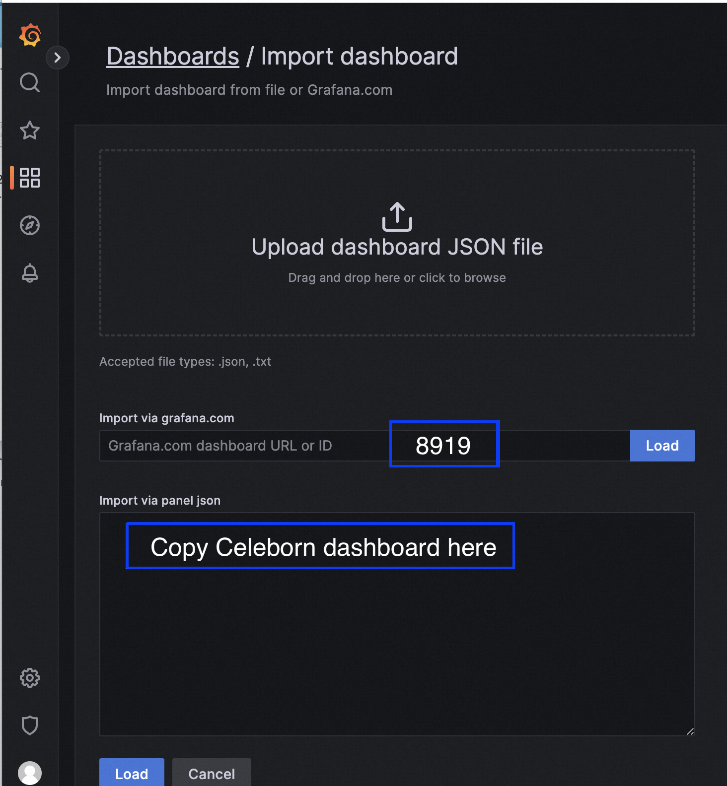
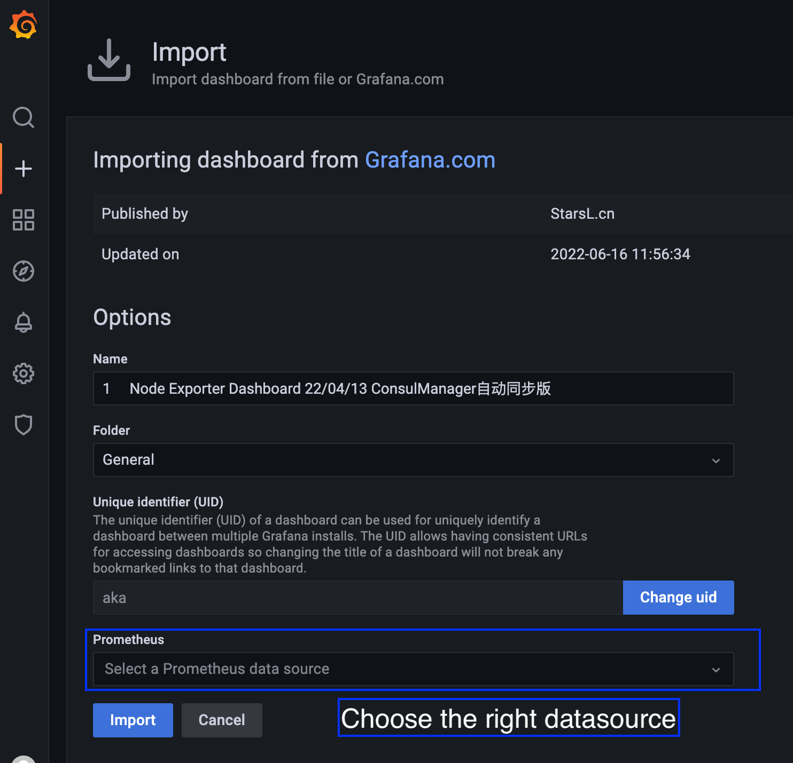

Monitoring
===

There are two ways to monitor Celeborn cluster: Prometheus metrics and REST API.

## Metrics

Celeborn has a configurable metrics system based on the
[Dropwizard Metrics Library](https://metrics.dropwizard.io/4.2.0).
This allows users to report Celeborn metrics to a variety of sinks including HTTP, JMX, CSV
files and prometheus servlet. The metrics are generated by sources embedded in the Celeborn code base.
They provide instrumentation for specific activities and Celeborn components.
The metrics system is configured via a configuration file that Celeborn expects to be present
at `$CELEBORN_HOME/conf/metrics.properties`. A custom file location can be specified via the
`celeborn.metrics.conf` [configuration property](https://celeborn.apache.org/docs/latest/configuration/#metrics).
Instead of using the configuration file, a set of configuration parameters with prefix
`celeborn.metrics.conf.` can be used.

Celeborn's metrics are divided into two
_instances_ corresponding to Celeborn components.  The following instances are currently supported:

* `master`: The Celeborn cluster master process.
* `worker`: The Celeborn cluster worker process.

Each instance can report to zero or more _sinks_. Sinks are contained in the
`org.apache.celeborn.common.metrics.sink` package:

* `CSVSink`: Exports metrics data to CSV files at regular intervals.
* `PrometheusServlet`: Adds a servlet within the existing Celeborn REST API to serve metrics data in Prometheus format.
* `GraphiteSink`: Sends metrics to a Graphite node.

The syntax of the metrics configuration file and the parameters available for each sink are defined
in an example configuration file,
`$CELEBORN_HOME/conf/metrics.properties.template`.

When using Celeborn configuration parameters instead of the metrics configuration file, the relevant
parameter names are composed by the prefix `celeborn.metrics.conf.` followed by the configuration
details, i.e. the parameters take the following form:
`celeborn.metrics.conf.[instance|*].sink.[sink_name].[parameter_name]`.
This example shows a list of Celeborn configuration parameters for a CSV sink:
```
"celeborn.metrics.conf.*.sink.csv.class"="org.apache.celeborn.common.metrics.sink.CsvSink"
"celeborn.metrics.conf.*.sink.csv.period"="1"
"celeborn.metrics.conf.*.sink.csv.unit"=minutes
"celeborn.metrics.conf.*.sink.csv.directory"=/tmp/
```

Default values of the Celeborn metrics configuration are as follows:
```
*.sink.prometheusServlet.class=org.apache.celeborn.common.metrics.sink.PrometheusServlet
```

Additional sources can be configured using the metrics configuration file or the configuration
parameter `celeborn.metrics.conf.[component_name].source.jvm.class=[source_name]`. At present the
no source is the available optional source. For example the following configuration parameter
activates the Example source:
`"celeborn.metrics.conf.*.source.jvm.class"="org.apache.celeborn.common.metrics.source.ExampleSource"`

### Available metrics providers

Metrics used by Celeborn are of multiple types: gauge, counter, histogram, meter and timer,
see [Dropwizard library documentation for details](https://metrics.dropwizard.io/4.2.0/getting-started.html).
The following list of components and metrics reports the name and some details about the available metrics,
grouped per component instance and source namespace.
The most common time of metrics used in Celeborn instrumentation are gauges and counters.
Counters can be recognized as they have the `.count` suffix. Timers, meters and histograms are annotated
in the list, the rest of the list elements are metrics of type gauge.
The large majority of metrics are active as soon as their parent component instance is configured,
some metrics require also to be enabled via an additional configuration parameter, the details are
reported in the list.

#### Master
These metrics are exposed by Celeborn master.

  - namespace=master
    
    | Metric Name              | Description                                                                     |
    |--------------------------|---------------------------------------------------------------------------------|
    | RegisteredShuffleCount   | The count of registered shuffle.                                                |
    | DeviceCelebornFreeBytes  | The actual usable space of Celeborn for device.                                 |
    | DeviceCelebornTotalBytes | The total space of Celeborn for device.                                         |
    | RunningApplicationCount  | The count of running applications.                                              |
    | ActiveShuffleSize        | The active shuffle size of workers.                                             |
    | ActiveShuffleFileCount   | The active shuffle file count of workers.                                       |
    | WorkerCount              | The count of active workers.                                                    |
    | LostWorkerCount          | The count of workers in lost list.                                              |
    | ExcludedWorkerCount      | The count of workers in excluded list.                                          |
    | AvailableWorkerCount     | The count of workers in available list.                                         |
    | ShutdownWorkerCount      | The count of workers in shutdown list.                                          |
    | DecommissionWorkerCount  | The count of workers in decommission list.                                      |
    | IsActiveMaster           | Whether the current master is active.                                           |
    | PartitionSize            | The size of estimated shuffle partition.                                        |
    | OfferSlotsTime           | The time for masters to handle `RequestSlots` request when registering shuffle. |

  - namespace=CPU

    | Metric Name  | Description             |
    |--------------|-------------------------|
    | JVMCPUTime   | The JVM costs cpu time. |

  - namespace=system

    | Metric Name           | Description                                   |
    |-----------------------|-----------------------------------------------|
    | LastMinuteSystemLoad  | The average system load for the last minute.  |
    | AvailableProcessors   | The amount of system available processors.    |

  - namespace=JVM
    - This source provides information on JVM metrics using the
    [Dropwizard/Codahale Metric Sets for JVM instrumentation](https://metrics.dropwizard.io/4.2.0/manual/jvm.html)
    and in particular the metric sets BufferPoolMetricSet, GarbageCollectorMetricSet and MemoryUsageGaugeSet.

  - namespace=ResourceConsumption
    - **notes:**
        - This metrics data is generated for each user and they are identified using a metric tag.
        - This metrics also include subResourceConsumptions generated for each application of user and they are identified using `applicationId` tag.
    
    | Metric Name       | Description                                         |
    |-------------------|-----------------------------------------------------|
    | diskFileCount     | The count of disk files consumption by each user.   |
    | diskBytesWritten  | The amount of disk files consumption by each user.  |
    | hdfsFileCount     | The count of hdfs files consumption by each user.   |
    | hdfsBytesWritten  | The amount of hdfs files consumption by each user.  |

  - namespace=ThreadPool
    - **notes:**
        - This metrics data is generated for each thread pool and they are identified using a metric tag by thread pool name.
    
    | Metric Name                  | Description                                                                                                                 |
    |------------------------------|-----------------------------------------------------------------------------------------------------------------------------|
    | active_thread_count          | The approximate number of threads that are actively executing tasks.                                                        |
    | pending_task_count           | The pending task not executed in block queue.                                                                               |
    | pool_size                    | The current number of threads in the pool.                                                                                  |
    | core_pool_size               | The core number of threads.                                                                                                 |
    | maximum_pool_size            | The maximum allowed number of threads.                                                                                      |
    | largest_pool_size            | The largest number of threads that have ever simultaneously been in the pool.                                               |
    | is_terminating               | Whether this executor is in the process of terminating after shutdown() or shutdownNow() but has not completely terminated. |
    | is_terminated                | Whether this executor is in the process of terminated after shutdown() or shutdownNow() and has completely terminated.      |
    | is_shutdown                  | Whether this executor is shutdown.                                                                                          |
    | thread_count                 | The thread count of current thread group.                                                                                   |
    | thread_is_terminated_count   | The terminated thread count of current thread group.                                                                        |
    | thread_is_shutdown_count     | The shutdown thread count of current thread group.                                                                          |

#### Worker
These metrics are exposed by Celeborn worker.

  - namespace=worker
    
    | Metric Name                                 | Description                                                                                                     |
    |---------------------------------------------|-----------------------------------------------------------------------------------------------------------------|
    | RegisteredShuffleCount                      | The count of registered shuffle.                                                                                |
    | RunningApplicationCount                     | The count of running applications.                                                                              |
    | ActiveShuffleSize                           | The active shuffle size of a worker including master replica and slave replica.                                 |
    | ActiveShuffleFileCount                      | The active shuffle file count of a worker including master replica and slave replica.                           |
    | OpenStreamTime                              | The time for a worker to process openStream RPC and return StreamHandle.                                        |
    | FetchChunkTime                              | The time for a worker to fetch a chunk which is 8MB by default from a reduced partition.                        |
    | ActiveChunkStreamCount                      | Active stream count for reduce partition reading streams.                                                       |
    | OpenStreamSuccessCount                      | The count of opening stream succeed in current worker.                                                          |
    | OpenStreamFailCount                         | The count of opening stream failed in current worker.                                                           |
    | FetchChunkSuccessCount                      | The count of fetching chunk succeed in current worker.                                                          |
    | FetchChunkFailCount                         | The count of fetching chunk failed in current worker.                                                           |
    | PrimaryPushDataTime                         | The time for a worker to handle a pushData RPC sent from a celeborn client.                                     |
    | ReplicaPushDataTime                         | The time for a worker to handle a pushData RPC sent from a celeborn worker by replicating.                      |
    | WriteDataHardSplitCount                     | The count of writing PushData or PushMergedData to HARD_SPLIT partition in current worker.                      |
    | WriteDataSuccessCount                       | The count of writing PushData or PushMergedData succeed in current worker.                                      |
    | WriteDataFailCount                          | The count of writing PushData or PushMergedData failed in current worker.                                       |
    | ReplicateDataFailCount                      | The count of replicating PushData or PushMergedData failed in current worker.                                   |
    | ReplicateDataWriteFailCount                 | The count of replicating PushData or PushMergedData failed caused by write failure in peer worker.              |
    | ReplicateDataCreateConnectionFailCount      | The count of replicating PushData or PushMergedData failed caused by creating connection failed in peer worker. |
    | ReplicateDataConnectionExceptionCount       | The count of replicating PushData or PushMergedData failed caused by connection exception in peer worker.       |
    | ReplicateDataFailNonCriticalCauseCount      | The count of replicating PushData or PushMergedData failed caused by non-critical exception in peer worker.     |
    | ReplicateDataTimeoutCount                   | The count of replicating PushData or PushMergedData failed caused by push timeout in peer worker.               |
    | PushDataHandshakeFailCount                  | The count of PushDataHandshake failed in current worker.                                                        |
    | RegionStartFailCount                        | The count of RegionStart failed in current worker.                                                              |
    | RegionFinishFailCount                       | The count of RegionFinish failed in current worker.                                                             |
    | PrimaryPushDataHandshakeTime                | PrimaryPushDataHandshake means handle PushData of primary partition location.                                   |
    | ReplicaPushDataHandshakeTime                | ReplicaPushDataHandshake means handle PushData of replica partition location.                                   |
    | PrimaryRegionStartTime                      | PrimaryRegionStart means handle RegionStart of primary partition location.                                      |
    | ReplicaRegionStartTime                      | ReplicaRegionStart means handle RegionStart of replica partition location.                                      |
    | PrimaryRegionFinishTime                     | PrimaryRegionFinish means handle RegionFinish of primary partition location.                                    |
    | ReplicaRegionFinishTime                     | ReplicaRegionFinish means handle RegionFinish of replica partition location.                                    |
    | PausePushDataTime                           | The time for a worker to stop receiving pushData from clients because of back pressure.                         |
    | PausePushDataAndReplicateTime               | The time for a worker to stop receiving pushData from clients and other workers because of back pressure.       |
    | PausePushData                               | The count for a worker to stop receiving pushData from clients because of back pressure.                        |
    | PausePushDataAndReplicate                   | The count for a worker to stop receiving pushData from clients and other workers because of back pressure.      |
    | TakeBufferTime                              | The time for a worker to take out a buffer from a disk flusher.                                                 |
    | FlushDataTime                               | The time for a worker to write a buffer which is 256KB by default to storage.                                   |
    | CommitFilesTime                             | The time for a worker to flush buffers and close files related to specified shuffle.                            |
    | SlotsAllocated                              | Slots allocated in last hour.                                                                                   |
    | ActiveSlotsCount                            | The number of slots currently being used in a worker.                                                           |
    | ReserveSlotsTime                            | ReserveSlots means acquire a disk buffer and record partition location.                                         |
    | ActiveConnectionCount                       | The count of active network connection.                                                                         |
    | NettyMemory                                 | The total amount of off-heap memory used by celeborn worker.                                                    |
    | SortTime                                    | The time for a worker to sort a shuffle file.                                                                   |
    | SortMemory                                  | The memory used by sorting shuffle files.                                                                       |
    | SortingFiles                                | The count of sorting shuffle files.                                                                             |
    | SortedFiles                                 | The count of sorted shuffle files.                                                                              |
    | SortedFileSize                              | The count of sorted shuffle files 's total size.                                                                |
    | DiskBuffer                                  | The memory occupied by pushData and pushMergedData which should be written to disk.                             |
    | BufferStreamReadBuffer                      | The memory used by credit stream read buffer.                                                                   |
    | ReadBufferDispatcherRequestsLength          | The queue size of read buffer allocation requests.                                                              |
    | ReadBufferAllocatedCount                    | Allocated read buffer count.                                                                                    |
    | ActiveCreditStreamCount                     | Active stream count for map partition reading streams.                                                          |
    | ActiveMapPartitionCount                     | The count of active map partition reading streams.                                                              |
    | CleanTaskQueueSize                          | The count of task for cleaning up expired shuffle keys.                                                         |
    | CleanExpiredShuffleKeysTime                 | The time for a worker to clean up shuffle data of expired shuffle keys.                                         |
    | DeviceOSFreeBytes                           | The actual usable space of OS for device monitor.                                                               |
    | DeviceOSTotalBytes                          | The total usable space of OS for device monitor.                                                                |
    | DeviceCelebornFreeBytes                     | The actual usable space of Celeborn for device.                                                                 |
    | DeviceCelebornTotalBytes                    | The total space of Celeborn for device.                                                                         |
    | PotentialConsumeSpeed                       | The speed of potential consumption for congestion control.                                                      |
    | UserProduceSpeed                            | The speed of user production for congestion control.                                                            |
    | WorkerConsumeSpeed                          | The speed of worker consumption for congestion control.                                                         |
    | IsDecommissioningWorker                     | 1 means worker decommissioning, 0 means not decommissioning.                                                    |
    | MemoryStorageFileCount                      | The count of files in Memory Storage of a worker.                                                               |
    | MemoryFileStorageSize                       | The total amount of memory used by Memory Storage.                                                              |
    | EvictedFileCount                            | The count of files evicted from Memory Storage to Disk                                                          |
    | DirectMemoryUsageRatio                      | Ratio of direct memory used and max direct memory.                                                              |
    | push_server_usedHeapMemory                  |                                                                                                                 |
    | push_server_usedDirectMemory                |                                                                                                                 |
    | push_server_numAllocations                  |                                                                                                                 |
    | push_server_numTinyAllocations              |                                                                                                                 |
    | push_server_numSmallAllocations             |                                                                                                                 |
    | push_server_numNormalAllocations            |                                                                                                                 |
    | push_server_numHugeAllocations              |                                                                                                                 |
    | push_server_numDeallocations                |                                                                                                                 |
    | push_server_numTinyDeallocations            |                                                                                                                 |
    | push_server_numSmallDeallocations           |                                                                                                                 |
    | push_server_numNormalDeallocations          |                                                                                                                 |
    | push_server_numHugeDeallocations            |                                                                                                                 |
    | push_server_numActiveAllocations            |                                                                                                                 |
    | push_server_numActiveTinyAllocations        |                                                                                                                 |
    | push_server_numActiveSmallAllocations       |                                                                                                                 |
    | push_server_numActiveNormalAllocations      |                                                                                                                 |
    | push_server_numActiveHugeAllocations        |                                                                                                                 |
    | push_server_numActiveBytes                  |                                                                                                                 |
    | replicate_server_usedHeapMemory             |                                                                                                                 |
    | replicate_server_usedDirectMemory           |                                                                                                                 |
    | replicate_server_numAllocations             |                                                                                                                 |
    | replicate_server_numTinyAllocations         |                                                                                                                 |
    | replicate_server_numSmallAllocations        |                                                                                                                 |
    | replicate_server_numNormalAllocations       |                                                                                                                 |
    | replicate_server_numHugeAllocations         |                                                                                                                 |
    | replicate_server_numDeallocations           |                                                                                                                 |
    | replicate_server_numTinyDeallocations       |                                                                                                                 |
    | replicate_server_numSmallDeallocations      |                                                                                                                 |
    | replicate_server_numNormalDeallocations     |                                                                                                                 |
    | replicate_server_numHugeDeallocations       |                                                                                                                 |
    | replicate_server_numActiveAllocations       |                                                                                                                 |
    | replicate_server_numActiveTinyAllocations   |                                                                                                                 |
    | replicate_server_numActiveSmallAllocations  |                                                                                                                 |
    | replicate_server_numActiveNormalAllocations |                                                                                                                 |
    | replicate_server_numActiveHugeAllocations   |                                                                                                                 |
    | replicate_server_numActiveBytes             |                                                                                                                 |
    | fetch_server_usedHeapMemory                 |                                                                                                                 |
    | fetch_server_usedDirectMemory               |                                                                                                                 |
    | fetch_server_numAllocations                 |                                                                                                                 |
    | fetch_server_numTinyAllocations             |                                                                                                                 |
    | fetch_server_numSmallAllocations            |                                                                                                                 |
    | fetch_server_numNormalAllocations           |                                                                                                                 |
    | fetch_server_numHugeAllocations             |                                                                                                                 |
    | fetch_server_numDeallocations               |                                                                                                                 |
    | fetch_server_numTinyDeallocations           |                                                                                                                 |
    | fetch_server_numSmallDeallocations          |                                                                                                                 |
    | fetch_server_numNormalDeallocations         |                                                                                                                 |
    | fetch_server_numHugeDeallocations           |                                                                                                                 |
    | fetch_server_numActiveAllocations           |                                                                                                                 |
    | fetch_server_numActiveTinyAllocations       |                                                                                                                 |
    | fetch_server_numActiveSmallAllocations      |                                                                                                                 |
    | fetch_server_numActiveNormalAllocations     |                                                                                                                 |
    | fetch_server_numActiveHugeAllocations       |                                                                                                                 |
    | fetch_server_numActiveBytes                 |                                                                                                                 |

  - namespace=CPU
    
    | Metric Name  | Description               |
    |--------------|---------------------------|
    | JVMCPUTime   | The JVM costs cpu time.   |

  - namespace=system

    | Metric Name            | Description                                           |
    |------------------------|-------------------------------------------------------|
    | LastMinuteSystemLoad   | Returns the system load average for the last minute.  |
    | AvailableProcessors    | The amount of system available processors.            |

  - namespace=JVM
    - This source provides information on JVM metrics using the
      [Dropwizard/Codahale Metric Sets for JVM instrumentation](https://metrics.dropwizard.io/4.2.0/manual/jvm.html)
      and in particular the metric sets BufferPoolMetricSet, GarbageCollectorMetricSet and MemoryUsageGaugeSet.

  - namespace=ResourceConsumption
    - **notes:**
        - This metrics data is generated for each user and they are identified using a metric tag.
        - This metrics also include subResourceConsumptions generated for each application of user and they are identified using `applicationId` tag.
    
    | Metric Name       | Description                                         |
    |-------------------|-----------------------------------------------------|
    | diskFileCount     | The count of disk files consumption by each user.   |
    | diskBytesWritten  | The amount of disk files consumption by each user.  |
    | hdfsFileCount     | The count of hdfs files consumption by each user.   |
    | hdfsBytesWritten  | The amount of hdfs files consumption by each user.  |

  - namespace=ThreadPool
    - **notes:**
        - This metrics data is generated for each thread pool and they are identified using a metric tag by thread pool name.
    
    | Metric Name            | Description                                                                                                                 |
    |------------------------|-----------------------------------------------------------------------------------------------------------------------------|
    | active_thread_count    | The approximate number of threads that are actively executing tasks.                                                        |
    | pending_task_count     | The pending task not executed in block queue.                                                                               |
    | pool_size              | The current number of threads in the pool.                                                                                  |
    | core_pool_size         | The core number of threads.                                                                                                 |
    | maximum_pool_size      | The maximum allowed number of threads.                                                                                      |
    | largest_pool_size      | The largest number of threads that have ever simultaneously been in the pool.                                               |
    | is_terminating         | Whether this executor is in the process of terminating after shutdown() or shutdownNow() but has not completely terminated. |
    | is_terminated          | Whether this executor is in the process of terminated after shutdown() or shutdownNow() and has completely terminated.      |
    | is_shutdown            | Whether this executor is shutdown.                                                                                          |

**Note:**

The Netty DirectArenaMetrics named like `push/fetch/replicate_server_numXX` are not exposed by default, nor in Grafana dashboard.
If there is a need, you can enable `celeborn.network.memory.allocator.verbose.metric` to expose these metrics.

### Setup Prometheus dashboard

1. Install Prometheus (https://prometheus.io/). We provide an example for Prometheus config file:

```yaml
# Prometheus example config
global:
  scrape_interval: 15s
  evaluation_interval: 15s

scrape_configs:
  - job_name: "Celeborn"
    metrics_path: /metrics/prometheus
    scrape_interval: 15s
    static_configs:
      - targets: [ "master-ip:9098","worker1-ip:9096","worker2-ip:9096","worker3-ip:9096","worker4-ip:9096" ]
```

2. Install Grafana server (https://grafana.com/grafana/download).

3. Import Celeborn dashboard into Grafana.

You can find the Celeborn dashboard templates under the `assets/grafana` directory.
`celeborn-dashboard.json` displays Celeborn internal metrics and `celeborn-jvm-dashboard.json` displays Celeborn JVM related metrics.

Here is an example of Grafana dashboard importing.







Here are some snapshots:


#### Optional
We recommend you to install node exporter (https://github.com/prometheus/node_exporter)
on every host, and configure Prometheus to scrape information about the host.
Grafana will need a dashboard (dashboard id:8919) to display host details.

```yaml
global:
  scrape_interval: 15s
  evaluation_interval: 15s

scrape_configs:
  - job_name: "Celeborn"
    metrics_path: /metrics/prometheus
    scrape_interval: 15s
    static_configs:
      - targets: [ "master-ip:9098","worker1-ip:9096","worker2-ip:9096","worker3-ip:9096","worker4-ip:9096" ]
  - job_name: "node"
    static_configs:
      - targets: [ "master-ip:9100","worker1-ip:9100","worker2-ip:9100","worker3-ip:9100","worker4-ip:9100" ]
```

## REST API

In addition to viewing the metrics, Celeborn also supports [REST API](webapi.md).
This gives developers an easy way to create new visualizations and monitoring tools for Celeborn and
also easy for users to get the running status of the service.
